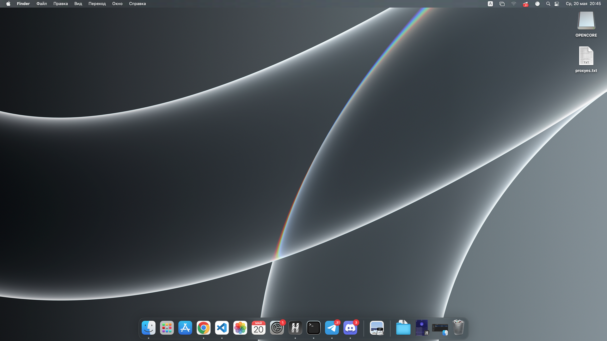

# TUF GAMING B560M-PLUS WIFI Hackintosh OpenCore

opencore config based on this [repository](https://github.com/DirieSoftie/TUF-GAMING-B560M-PLUS-WIFI-Hackintosh), with some tweaks for my system

# Info
* Monterey
* OpenCore 0.8.2
* ASUS TUF Gaming B560M-Plus WiFi
* Processor: i5 11400F (11-gen)
* Nvidia Geforce GTX 950 (Patched using [OpenCore Legacy Patcher](https://github.com/dortania/OpenCore-Legacy-Patcher/).)
* 8GB Kingston Fury DDR4-3200 RAM

What's working: 

* it boots 
* dual display is working with some issues
* accelerated graphics with [OpenCore Legacy Patcher](https://github.com/dortania/OpenCore-Legacy-Patcher/)(rocket lake iGPU not supported)
* sound works
* on board ethernet works
* all USB ports work
* sleep works
* WiFi works
* iServices
  * iMessage
  * FaceTime
  * iCloud
  * Siri

What's *NOT* working:

* AppleTV+ Playback (too lazy to fix)
* Bluetooth
* AirDrop/Handoff

# Credit:

* [OpenCore Legacy Patcher](https://github.com/dortania/OpenCore-Legacy-Patcher/)
* [OpenCorePkg](https://github.com/acidanthera/OpenCorePkg)
* [Dortania's OpenCore Install Guide](https://dortania.github.io/OpenCore-Install-Guide/)
* Initial config based on: https://github.com/uranium81/hackintosh-intel-11th-gen/ and https://github.com/DirieSoftie/TUF-GAMING-B560M-PLUS-WIFI-Hackintosh

